# запуск

Поменять в prometheus.yml ip адрес на свой

```
pacman -S prometheus-node-exporter
docker-compose up -d
```
проверьте что 3000, 9100, 9090, 9399, 5432, 9092 порта открыты и работают

в cron добавьте:
```
*/20 * * * * cdxgen -t os -o /root/task4/sbom/sbom.json && cd /root/task4 && uv run task2.py && osv-scanner scan --sbom sbom/sbom.json --format json > osv.json  && uv run task3.py
```

Можно вручную на другой машине, файлы прилагаются:
```
uv run task2.py;
uv run task3.py;
```

Посмотрите http://localhost:9399/metrics и используйте эти метрики для отрисовки в grafana http://localhost:3000.

В alert rules видим алерты

Для 5 в cron измените:
```
*/20 * * * * cdxgen -t os -o /root/task4/sbom/sbom.json && cd /root/task4 && uv run task5_sbom.py && osv-scanner scan --sbom sbom/sbom.json --format json > osv.json  && uv run task5_osv.py
```

В терминале запустите:
```
uv run task5_consumer.py
```

# отчет
В рамках выполнения первой задачи была развернута базовая система мониторинга инфраструктуры. Для визуализации метрик использовалась Grafana, для хранения и обработки временных рядов — Prometheus, а для сбора системных метрик с Linux-хоста — Node Exporter. Сервисы Grafana и Prometheus были развернуты в контейнерах Docker с использованием Docker Compose, что позволило централизованно управлять инфраструктурой мониторинга и упростило процесс настройки. Node Exporter был установлен непосредственно на Linux-дистрибутиве, так как данный агент должен получать доступ к системным метрикам хостовой операционной системы, включая информацию о процессоре, памяти, файловой системе и сетевых интерфейсах.

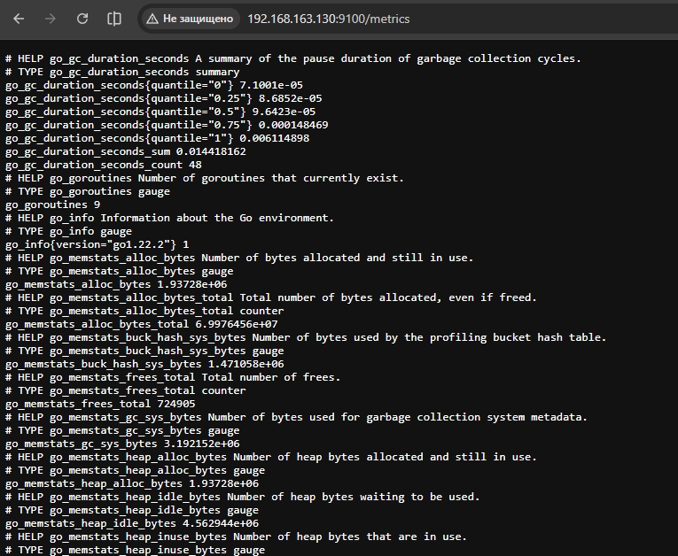

После запуска контейнеров был настроен Prometheus для периодического опроса Node Exporter через механизм scrape targets. Для этого в конфигурационный файл Prometheus были добавлены параметры подключения к Node Exporter, работающему на Linux-хосте. Далее Grafana была подключена к Prometheus как к источнику данных. После успешного подключения были созданы панели мониторинга, отображающие основные системные метрики: загрузку процессора, использование оперативной памяти, сетевую активность и состояние файловой системы. Работоспособность системы была проверена через web-интерфейсы Prometheus и Grafana, а также через отображение поступающих метрик в режиме реального времени.

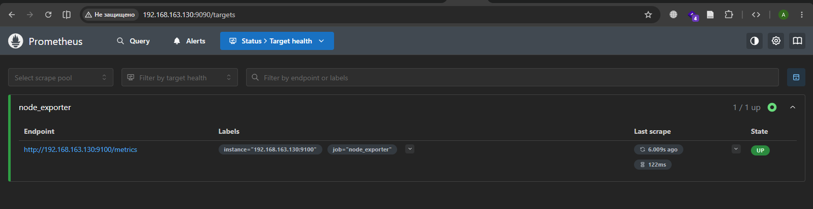

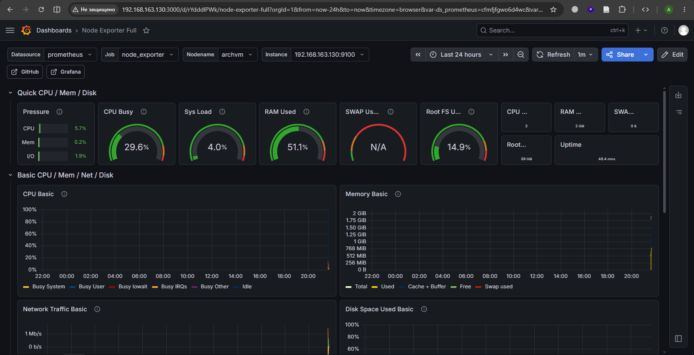

В рамках второй задачи было выполнено сканирование операционной системы, на которой развернут Node Exporter. Для получения информации об установленном программном обеспечении использовался cdxgen. Инструмент формировал SBOM-файл в формате CycloneDX, содержащий перечень установленных пакетов и компонентов системы. Полученный JSON-файл использовался для последующей загрузки данных в базу данных PostgreSQL.

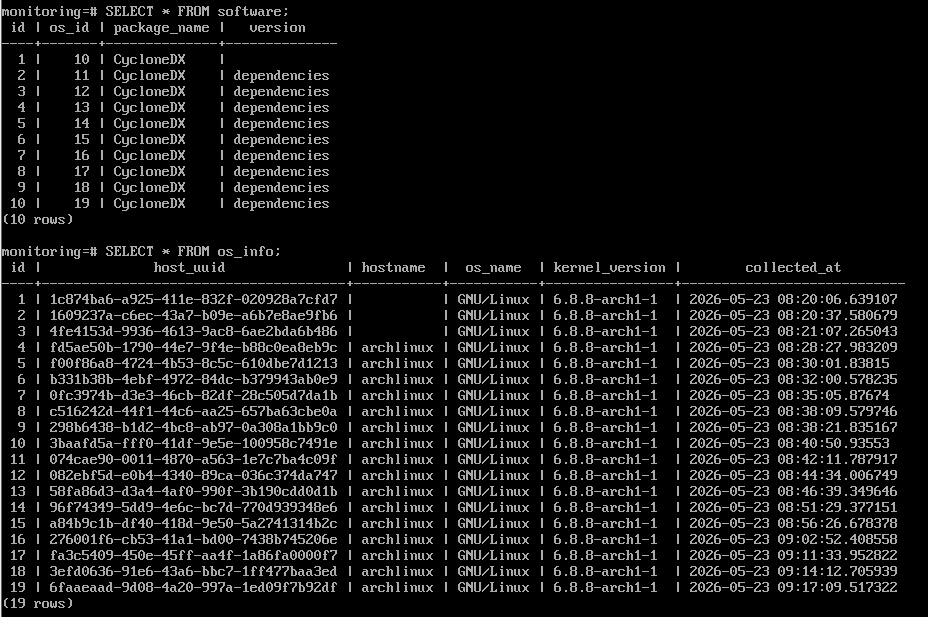

Для хранения информации была спроектирована собственная структура базы данных. В базе были созданы таблицы для хранения информации об операционной системе, включая уникальный идентификатор хоста, имя хоста, название операционной системы, версию ядра и время сканирования. Дополнительно была создана таблица с перечнем установленного программного обеспечения, связанная с таблицей сканирований через внешний ключ. Загрузка данных в базу выполнялась автоматически с помощью Python-скриптов, которые анализировали содержимое SBOM-файла и формировали SQL-запросы для вставки информации в PostgreSQL.

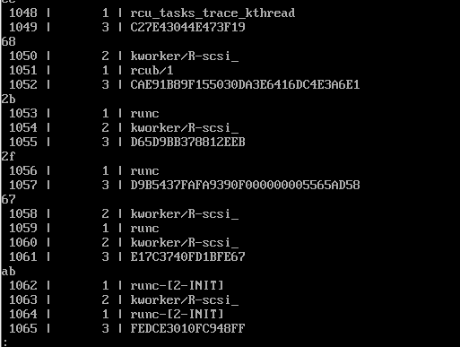

Для экспорта данных из базы данных в систему мониторинга был развернут SQL Exporter. Через SQL Exporter были настроены SQL-запросы, возвращающие сводную информацию о системе. В Grafana были созданы панели мониторинга, отображающие последнюю информацию об операционной системе и количество установленного программного обеспечения. Таблица с последней информацией по ОС содержала имя хоста, название операционной системы, версию ядра и время последнего сканирования. Дополнительно был построен график количества установленных пакетов, позволяющий отслеживать изменения программного окружения системы во времени.

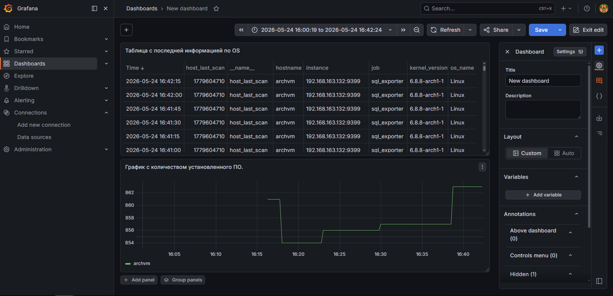

Автоматизация процесса сканирования была реализована через cron. Каждые двадцать минут выполнялся запуск cdxgen, генерация нового SBOM-файла и последующая загрузка данных в PostgreSQL. Интервал в двадцать минут был выбран как компромисс между актуальностью информации и нагрузкой на систему, поскольку более частый запуск сканирования значительно увеличивает нагрузку на диск, процессор и систему контейнеризации Docker, а также скоростью работы cdxgen.

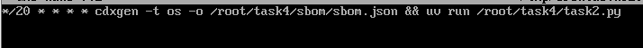

В рамках третьей задачи был реализован механизм поиска и мониторинга уязвимостей установленного программного обеспечения. Для анализа компонентов системы использовался osv-scanner, который выполнял проверку ранее сформированного SBOM-файла формата CycloneDX на наличие известных уязвимостей. В результате работы osv-scanner формировался JSON-файл, содержащий сведения об обнаруженных уязвимостях, их идентификаторах, уровне критичности, описании и программных пакетах, в которых они были найдены.

Для хранения информации о найденных уязвимостях структура базы данных PostgreSQL была расширена новыми таблицами. Была создана таблица vulnerability, предназначенная для хранения уникальных идентификаторов уязвимостей, краткого описания и уровня критичности. Дополнительно была реализована таблица vulnerability_scans, в которой сохранялась информация о фактах обнаружения уязвимостей в конкретных пакетах и версиях программного обеспечения, а также привязка к определённому сканированию системы. Такая структура позволила избежать дублирования данных и обеспечила возможность отслеживания изменений количества уязвимостей во времени.

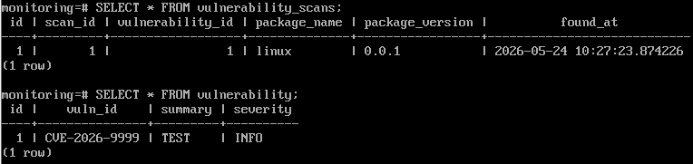

Для автоматической загрузки результатов работы osv-scanner в базу данных был разработан Python-скрипт, выполняющий обработку JSON-файла и формирование SQL-запросов. Скрипт анализировал список найденных пакетов и уязвимостей, проверял наличие уязвимости в таблице vulnerability и, при необходимости, добавлял новую запись. После этого информация о факте обнаружения уязвимости записывалась в таблицу vulnerability_scans с указанием идентификатора сканирования, имени пакета и версии программного обеспечения.

Для интеграции базы данных с системой мониторинга использовался SQL Exporter, который выполнял SQL-запросы к PostgreSQL и экспортировал результаты в Prometheus. На основе этих метрик в Grafana были созданы панели мониторинга уязвимостей. Первая панель представляла собой таблицу с актуальными данными об уязвимостях на активе, включая идентификатор уязвимости, уровень критичности, описание, пакет и версию программного обеспечения. Вторая панель отображала временной график количества уязвимостей с группировкой по уровням критичности, что позволяло отслеживать динамику изменения состояния безопасности системы.

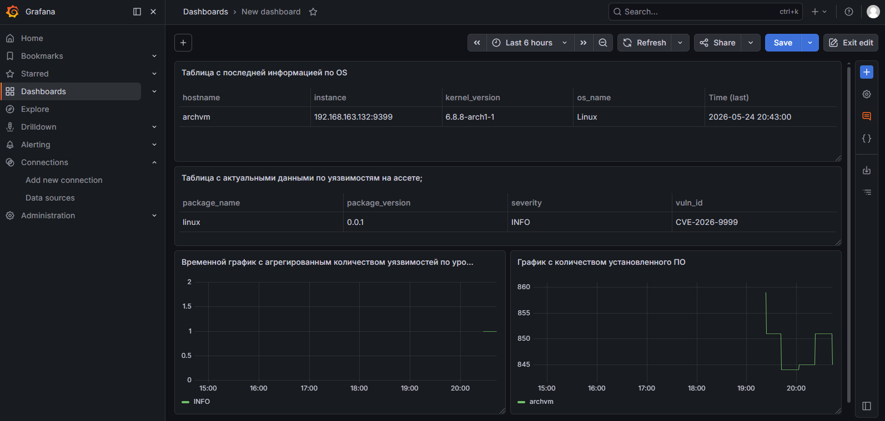

Автоматизация процесса была реализована через cron. Каждые пять минут выполнялся запуск osv-scanner, генерация нового отчёта об уязвимостях и загрузка данных в PostgreSQL. Интервал в пять минут был выбран для обеспечения актуальности информации о состоянии безопасности системы и при этом не создавал чрезмерной нагрузки на систему. Более частый запуск сканирования мог бы привести к увеличению потребления процессорных ресурсов и времени обработки данных, особенно при большом количестве установленных пакетов.

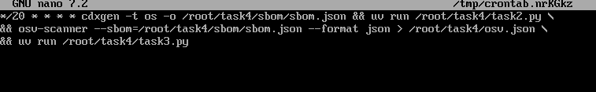

В рамках четвёртой задачи была выполнена настройка системы оповещений для контроля поступления данных сканирования и мониторинга уязвимостей. Алерты были реализованы средствами Prometheus и визуализированы через Grafana без использования внешних каналов уведомлений, таких как электронная почта или мессенджеры. Основной задачей являлось обнаружение ситуаций, при которых перестают поступать данные от процессов сканирования системы или количество уязвимостей превышает допустимые значения.

Для контроля работоспособности процесса генерации SBOM был настроен heartbeat-алерт на поступление данных от cdxgen. Проверка выполнялась каждую минуту на основе времени последнего сканирования, сохранённого в базе данных PostgreSQL и экспортируемого через SQL Exporter. Если в течение более чем 30 минут в базу данных не поступали новые записи о сканировании программного обеспечения, Prometheus переводил состояние правила в Alerting. Такой механизм позволял своевременно обнаружить остановку cron-задачи, сбой cdxgen или проблемы взаимодействия с базой данных.

Аналогичным образом был настроен heartbeat-алерт для контроля поступления данных от osv-scanner. Проверка выполнялась каждую минуту и анализировала время последнего добавления информации об уязвимостях. При отсутствии новых результатов сканирования в течение более 30 минут формировалось предупреждение о возможной остановке процесса анализа уязвимостей или ошибке при загрузке данных в базу. Такой подход позволял контролировать непрерывность работы системы оценки безопасности программного обеспечения.

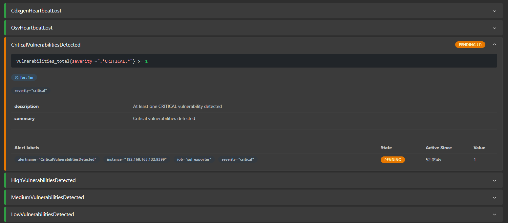

Дополнительно была реализована система алертов на количество обнаруженных уязвимостей. Для этого в Prometheus были настроены запросы к метрикам, экспортируемым SQL Exporter из PostgreSQL. Правила оповещений анализировали количество уязвимостей различных уровней критичности и переводили алерт в состояние Alerting при превышении заданных пороговых значений. Срабатывание происходило при обнаружении хотя бы одной уязвимости уровня Critical, трёх уязвимостей уровня High, пяти уязвимостей уровня Medium или десяти уязвимостей более низких уровней критичности. Такой механизм позволял автоматически выявлять ухудшение состояния безопасности системы и своевременно реагировать на появление опасных компонентов в программном окружении.

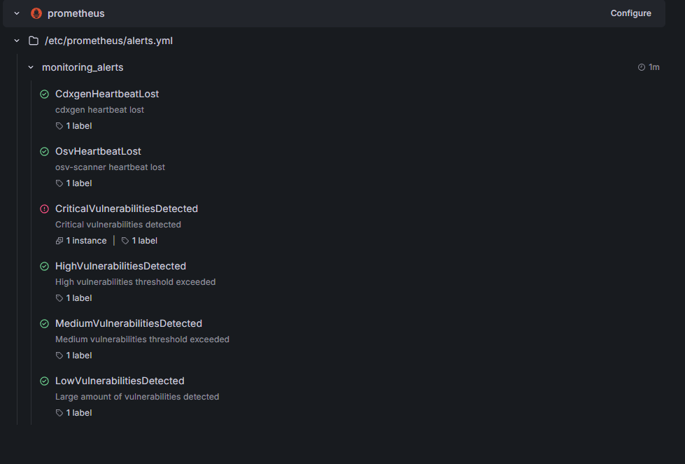

Для проверки корректности работы алертов выполнялось ручное добавление тестовых уязвимостей в базу данных, а также временная остановка процессов сканирования. После прекращения поступления данных Prometheus успешно переводил heartbeat-алерты в состояние Alerting через заданный интервал времени. Аналогично при увеличении количества уязвимостей выше установленных порогов в Grafana отображалось активное состояние правил оповещения. Это подтвердило корректность настройки системы мониторинга безопасности и работоспособность механизма обнаружения инцидентов.

##

В рамках пятой задачи была выполнена доработка архитектуры агентского сканирования, реализованного в предыдущих заданиях. Изначально данные, полученные после работы cdxgen и osv-scanner, напрямую отправлялись в PostgreSQL с помощью Python-скриптов. После модернизации архитектуры между системой сканирования и базой данных был добавлен брокер сообщений Apache Kafka, развернутый в Docker-контейнере. В результате схема передачи данных была изменена с прямой записи в БД на потоковую архитектуру вида VM Linux → Kafka → PostgreSQL.

Kafka была развернута через Docker Compose совместно с Zookeeper. После запуска контейнеров были созданы отдельные topics для передачи данных инвентаризации программного обеспечения и информации об уязвимостях. Локально запускаемые Python-скрипты, выполнявшие обработку SBOM и результатов osv-scanner, были доработаны и переведены в режим producers. Вместо формирования SQL-запросов к PostgreSQL они начали сериализовывать результаты сканирования в JSON и отправлять сообщения в Kafka topics через библиотеку kafka-python.

Для обработки сообщений был реализован отдельный consumer-сервис на Python. Consumer работал в постоянном режиме и непрерывно прослушивал Kafka topics, получая сообщения от producers. После получения данных consumer выполнял их обработку и формировал SQL-запросы для записи информации в PostgreSQL. Для данных инвентаризации программного обеспечения consumer добавлял сведения о хосте, сканировании и установленных пакетах в таблицы hosts, scans и software. Для данных об уязвимостях consumer обновлял таблицы vulnerability и vulnerability_scans, фиксируя найденные уязвимости и программные компоненты, в которых они были обнаружены.

Автоматизация процесса осталась реализованной через cron на Linux-хосте. Каждые пять минут выполнялся запуск cdxgen и osv-scanner, после чего producers отправляли результаты работы в Kafka. Consumer-сервис автоматически принимал сообщения и сохранял данные в PostgreSQL. Такой подход обеспечил асинхронную обработку информации и позволил разделить процессы генерации данных и их записи в базу данных.

Использование Apache Kafka позволило повысить отказоустойчивость и масштабируемость системы мониторинга. Producers и consumers стали независимыми компонентами, что упростило обработку ошибок и позволило буферизировать сообщения при временной недоступности базы данных. Кроме того, потоковая архитектура обеспечила возможность дальнейшего масштабирования системы, например подключения дополнительных consumers или интеграции с другими системами мониторинга и анализа безопасности.